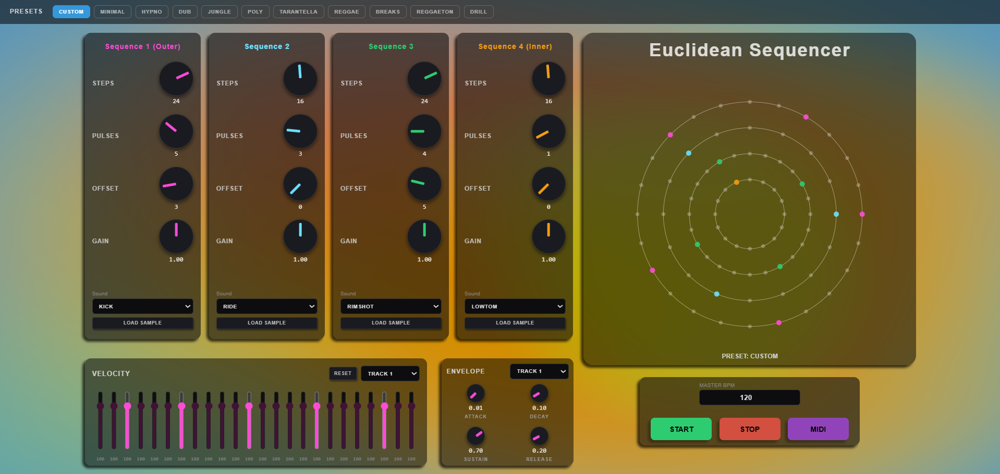
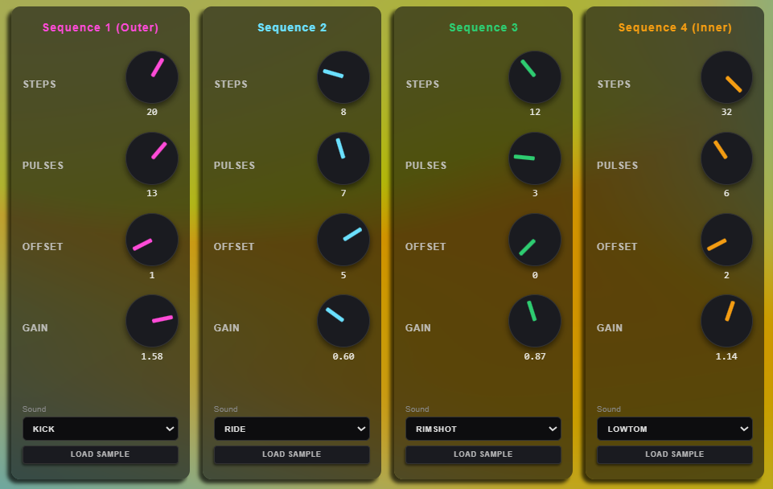
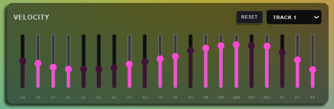
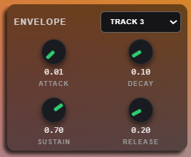
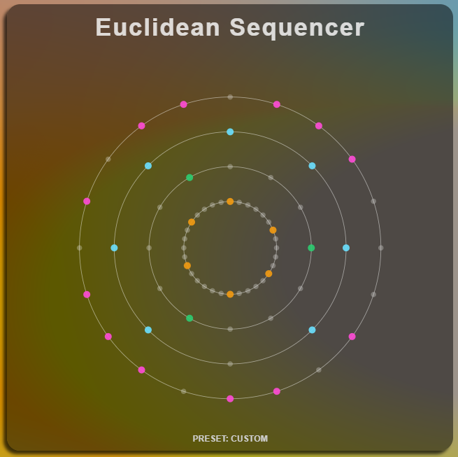
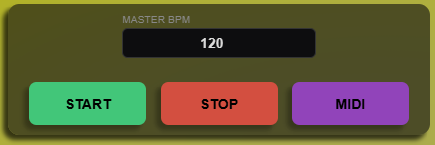

# Euclidean Sequencer


> A web-based Euclidean Sequencer capable of generating complex rhythmic patterns using the Bjorklund Algorithm, featuring MIDI export functionalities.

<br />

<div align="center">
  
</div>

<br />

## 📖 About The Sequencer

The **Euclidean Sequencer** is a creative musical tool that distributes a specific number of pulses (hits) as evenly as possible over a specific number of steps (time divisions). This mathematical approach, based on the **Bjorklund algorithm**, can be usefull to generate rhythmic lines. This sequencer give the possibility to experiment with up to four different rhythmic lines simultaneously.

This application runs entirely in the browser using **Web Audio API** (via Tone.js) and features a shader-based reactive background (via Three.js).

## 🌟 Key Features

* **Euclidean Generation:** Control Steps, Pulses, and Offset for 4 independent tracks.
* **Interactive Visualizer:**
    * Circular SVG visualization of the rhythm patterns.
    * Toggle individual steps manually by clicking dots in the visualizer.
* **Audio Control:**
    * **Velocity Drawing:** Draw dynamic velocity curves directly on the interface.
    * **ADSR Envelope:** Shape the gain envelope (Attack, Decay, Sustain, Release) per track.
    * **Sample Management:** Use built-in samples (Kick, Snare, Hats, etc.) or **upload** custom audio files.
* **Presets:** Includes the possibility to start from presets.
* **MIDI Export:** Download the sequence as a `.mid` file to use in any DAW (Ableton, Logic, FL Studio) preserving velocity data.

## 🛠️ Project Structure

* **Core:** HTML5, CSS3, Vanilla JavaScript.
* **Audio Engine:** [Tone.js](https://tonejs.github.io/) - Handles clock, triggers and players.
* **Visuals:** [Three.js](https://threejs.org/) (https://codepen.io/cameronknight/pen/ogxWmBP) - Handles fluid gradient background.
* **Utilities:** [MidiWriterJS](https://github.com/grimmdude/MidiWriterJS) - Handles the MIDI file generation.

## 🚀 How to Run Locally

Since this application relies on modern web standards and ES6 modules, it is best run via a local server to avoid Cross-Origin Resource Sharing errors with audio files.

1.  **Clone the repository**
    ```bash
    git clone https://github.com/SamueleSasso/ACTAM-2025-26-EUCLIDEAN-SEQUENCER.git
    ```
2.  **Navigate to the folder**
    ```bash
    cd ACTAM-2025-26-EUCLIDEAN-SEQUENCER
    ```
3.  **Start a local server**
    * If using **VS Code**: Install the "Live Server" extension and click "Go Live" on `index.html`.
    * Open your browser at `http://localhost:8000`.

## 🎛️ Manual & Controls

Controls and visuals are allocated dinamically with  in functions ```initInterface()``` ```initVelocityPanel()``` ```initAdsrPanel()```.
### The Tracks
The sequencer consists of 4 concentric rings (Tracks):
1.  **Track 1 (Outer - Pink):** 
2.  **Track 2 (Blue):** 
3.  **Track 3 (Green):** 
4.  **Track 4 (Inner - Orange):**

### Knob Controls
* **STEPS:** Sets the length of the loop (1 to 32 steps).
* **PULSES:** Sets how many active notes are played within the loop. The euclidean algorithm automatically spaces them out.
* **OFFSET:** Rotates the pattern to shift the starting point.
* **GAIN:** Controls the volume of the specific track.

<br />

<div align="center">
  
</div>

<br />

  
### Velocity & Envelope
* **Velocity Panel:** Click and drag across the bars at the bottom left to "draw" volume dynamics for the selected track.
<br />

<div align="center">
  
</div>
<br />

* **ADSR Panel:** Adjust the *Attack, Decay, Sustain,* and *Release* to change the shape of the sound (e.g., make a sample snappy or soft).
<br />

<div align="center">
  
</div>

<br />

### Circular Visualizer
The pattern is raffigurated in a circular way. Every pulse is raffigurated by a colored dot. Toggle individual dots manually activate the relative steps.

<br />

<div align="center">
  
</div>

<br />

### Global Controls

The global controls section is divided in:
* **START/STOP** to trigger the sequence. start/stop can be triggered by pressing `SPACEBAR`.
* **BPM** BPM can be set both sliding or typing.
* **MIDI export**.

<br />

<div align="center">
  
</div>

<br />

## 1️⃣0️⃣0️⃣1️⃣0️⃣ Algorithm Description

The Euclidean algorithm computes the greatest common divisor (GCD) of two integer numbers. In the context of rhythm, it is used to solve the problem of distributing $k$ pulses over $n$ steps as evenly as possible.

For example, distributing **4 pulses** over **16 steps** results in:
`[ 1, 0, 0, 0, 1, 0, 0, 0, 1, 0, 0, 0, 1, 0, 0, 0 ]` (A standard 4/4 beat).

Distributing **3 pulses** over **8 steps** results in:
`[ 1, 0, 0, 1, 0, 0, 1, 0 ]`.

A common method of representing musical rhythms is as binary sequences, where each bit is considered
as one unit of time, and a zero bit represents a silence and a one bit represents an attack (or onset) of a note. Since Euclidean algorithm give the same arrays as a Bjorklund algorithm, we decided to implement the latest in the application in function generateEuclideanPattern:
```javascript
function generateEuclideanPattern(steps, pulses) {
    if (pulses >= steps) return Array(steps).fill(1);
    if (pulses <= 0) return Array(steps).fill(0);
    let divisor = steps - pulses;
    let remainders = [pulses];
    let counts = [];
    let level = 0;
    while (remainders[level] > 1) {
        counts.push(Math.floor(divisor / remainders[level]));
        remainders.push(divisor % remainders[level]);
        divisor = remainders[level];
        level++;
    }
    counts.push(divisor);
    function build(l) {
        if (l === -1) return [0];
        if (l === -2) return [1];
        let res = [];
        let seq = build(l - 1);
        let alt = build(l - 2);
        for (let i = 0; i < counts[l]; i++) res = res.concat(seq);
        if (remainders[l] !== 0) res = res.concat(alt);
        return res;
    }
    return build(level).slice(0, steps);
}
```
Details about Euclidean algorythms in relation to traditionals patterns in the paper "The Euclidean Algorithm Generates Traditional Musical Rhythms" (https://citeseerx.ist.psu.edu/viewdoc/download?doi=10.1.1.72.1340&rep=rep1&type=pdf)

## 🎹 MIDI Integration
### Resolution & Time Conversion

The MIDI export functionality is based on the library **MidiWriterJS**.
The sequencer runs on a visual grid of "steps" (1-32), but MIDI files rely on "Ticks" (Pulses Per Quarter Note).
* **Resolution:** We use a resolution of **512 ticks per bar**.
* **Translation to MIDI:** The code calculates the start and end time of every single step in MIDI ticks.
* **Loop:** The pattern is automatically looped for **4 Bars** to create a usable musical phrase for the user.
The logic behind the MIDI integration is in ```function downloadMIDI()  ```

### Modal Interface

The user can select which sequence to export in MIDI and can decide to take track of the velocity in a modal interface. The sequences will be stored in a single .mid file containing different sequences.
<br />

<div align="center">
  
</div>

<br />


## 🔊 Audio Architecture (Tone.js)

The application relies on **[Tone.js](https://tonejs.github.io/)** for precise scheduling and sample management. The engine is structured in the following way:

* **Player Pooling:** To ensure seamless play during rapid triggers (like drum rolls), the system implements a **Round-Robin pooling strategy**. Instead of a single player per sample, each sample is loaded into a pool of multiple `Tone.Player` instances. This prevents audio cut-offs when a sound is re-triggered while the previous one is still active.
* **Signal Routing:** Each track features its own dedicated `Tone.Gain` node, allowing for independent volume managing before the signal reaches the `Tone.Destination`.
* **Dynamic Envelopes:** A custom ADSR logic modulates the gain node of each active player in real-time. This function works on `Tone.Gain` to not modify the sample buffer.

## 🕰️ Clock (Tone.js)

This application creates a dynamic measures to handle polyrhythmic stuctuires (e.g., playing a 5-step loop against a 12-step loop). The clock logic relies on `Tone.Transport` but modifies the resolution dynamically. Tone.Transport solves time by using the Web Audio API context time (an hardware clock that runs independently of the visual rendering).

* **The Master Cycle (time subdivision):** When user press start, the engine calculates the **Least Common Multiple (LCM)** of all active track steps (e.g., if you have two tracks of length 4 and 3, the master cycle is 12).
* **The Micro-Step:** The `playStep()` function acts as a gatekeeper. It runs at the sub-division level.
* **Modulo Scheduling:** For every micro-tick, the system checks if a specific track should advance based on the formula: `globalStep % (MasterCycle / TrackSteps) === 0`.

This approach ensures that tracks with completely different time intervals (odd time signatures) remain mathematically locked to the master BPM without drifting, effectively creating a loop that resolves perfectly when the LCM is reached.

## Author

**[Your Name]**
* GitHub: [@dadymazz](https://github.com/dadymazz) [@SamueleSasso](https://github.com/SamueleSasso) 
* Project Link: [https://github.com/SamueleSasso/ACTAM-2025-26-EUCLIDEAN-SEQUENCER](https://github.com/SamueleSasso/ACTAM-2025-26-EUCLIDEAN-SEQUENCER)
